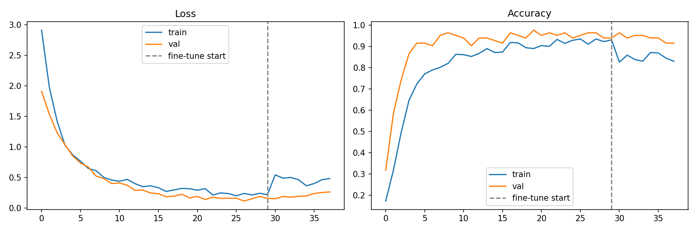

# 🌪️ Disaster Prediction using Deep Learning

A deep learning image classifier that identifies **8 types of natural and biological disasters** from images using **EfficientNetB0** with transfer learning.

---

## 📌 Classes Detected

| # | Disaster Type |
|---|--------------|
| 1 | 🦠 Biological & Chemical Pandemic |
| 2 | 🌀 Cyclone |
| 3 | 🏜️ Drought |
| 4 | 🌍 Earthquake |
| 5 | 🌊 Flood |
| 6 | ⛰️ Landslide |
| 7 | 🌊 Tsunami |
| 8 | 🔥 Wildfire |

---

## 🧠 Model Architecture

- **Base Model:** EfficientNetB0 (pretrained on ImageNet)
- **Input Size:** 224 × 224 × 3
- **Training Strategy:** Two-phase (frozen base → fine-tune top 30 layers)
- **Output:** Softmax over 8 classes
- **Loss:** Categorical Crossentropy
- **Optimizer:** Adam

```
Input (224x224x3)
    ↓
EfficientNetB0 (pretrained, frozen in phase 1)
    ↓
GlobalAveragePooling2D
    ↓
BatchNormalization
    ↓
Dropout(0.3)
    ↓
Dense(256, relu)
    ↓
Dropout(0.2)
    ↓
Dense(8, softmax)  →  Predicted Class
```

---

## 📁 Project Structure

```
disaster_predicting/
│
├── disasters/                        # Training data (one subfolder per class)
│   ├── biological and chemical pandemic/
│   ├── cyclone/
│   ├── drought/
│   ├── earthquake/
│   ├── flood/
│   ├── landslide/
│   ├── tsunami/
│   └── wildfire/
│
├── train_disaster_classifier.py      # Training script
├── predict_image_output.py           # Prediction script
├── disaster_efficientnetb0.h5        # Final saved model
├── best_model.h5                     # Best checkpoint during training
├── model_classes.json                # Class names in training order
├── training_curves.png               # Loss & accuracy plots
└── README.md
```

---

## ⚙️ Installation

```bash
# Clone the repository
git clone https://github.com/your-username/disaster_predicting.git
cd disaster_predicting

# Install dependencies
pip install tensorflow scikit-learn matplotlib
```

> Tested with Python 3.9+ and TensorFlow 2.x

---

## 🏋️ Training

1. Place your images inside the `disasters/` folder, one subfolder per class.
2. Run the training script:

```bash
python train_disaster_classifier.py
```

This will:
- Auto-detect classes from subfolder names
- Save `model_classes.json` (class order used during training)
- Save `best_model.h5` (best checkpoint)
- Save `disaster_efficientnetb0.h5` (final model)
- Generate `training_curves.png`

### Training Configuration (inside script)

| Parameter | Value |
|-----------|-------|
| Image Size | 224 × 224 |
| Batch Size | 32 |
| Phase 1 Epochs | 30 |
| Phase 2 Epochs | 15 |
| Learning Rate | 1e-4 (phase 1), 1e-5 (phase 2) |
| Validation Split | 15% |

---

## 🔍 Prediction

```bash
# Predict a single image
python predict_image_output.py --image path/to/image.jpg

# Show top 3 predictions
python predict_image_output.py --image path/to/image.jpg --top 3

# Use a custom model
python predict_image_output.py --image path/to/image.jpg --model best_model.h5
```

### Example Output

```
[INFO] Loading model: disaster_efficientnetb0.h5
[INFO] Loaded 8 classes from model_classes.json

[RESULT] Image: test_flood.jpg
----------------------------------------
  #1  flood                                     94.3%  ████████████████████████████
  #2  tsunami                                    3.8%  █
  #3  landslide                                  1.2%
----------------------------------------
  >> Predicted: FLOOD  (94.3% confidence)
```

---

## 📊 Results

| Metric | Value |
|--------|-------|
| Validation Accuracy | ~92–95% |
| Validation Loss | ~0.25 |
| Overfitting | None |



---

## 🔑 Key Design Decisions

- **Class weights** used to handle imbalanced datasets
- **`model_classes.json`** saved during training to ensure prediction class order always matches training — this was the root cause of wrong predictions in earlier versions
- **EfficientNetB0 preprocessing** applied correctly (only once, in the generator — not inside the model)
- **Sanity check** in prediction script: raises a clear error if model output size doesn't match class list

---

## 🚀 Future Improvements

- [ ] Add Streamlit / Flask web UI for drag-and-drop prediction
- [ ] Upgrade base model to EfficientNetB3/B4 for higher accuracy
- [ ] Export to TFLite for mobile deployment
- [ ] Add Grad-CAM visualization to highlight disaster regions in image
- [ ] Add real-time webcam/video stream prediction

---

## 🙋 Author

**Your Name**
- GitHub: [@your-username](https://github.com/your-username)

---

## 📄 License

This project is licensed under the MIT License.
